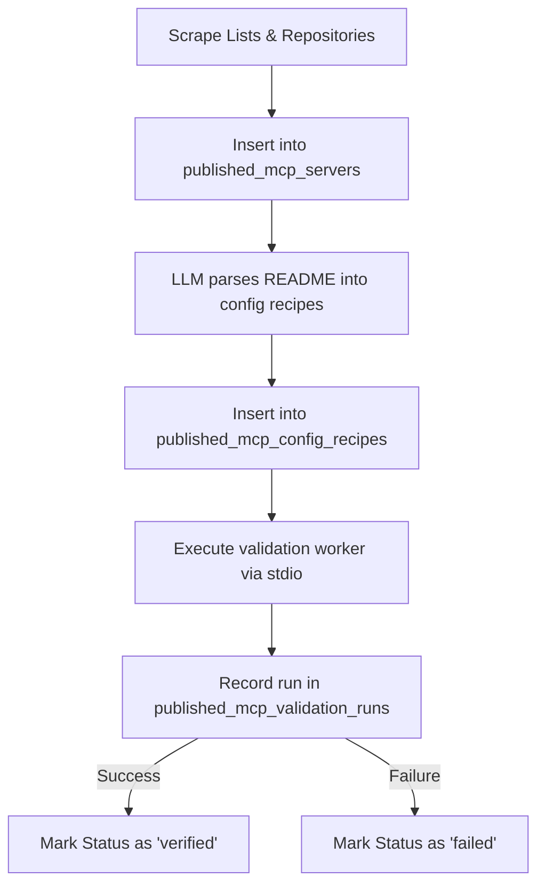

# TormentNexus Agent Registry & Scraped Skills

This document describes how agents, skills, and Model Context Protocol (MCP) servers are registry-managed and orchestrated within the TormentNexus environment.

---

## 1. Agent Swarm Architecture

TormentNexus runs an **Agent-to-Agent (A2A)** swarm system. This architecture permits decentralized coordination, task broadcasting, and role/skill matching.

* **FreeLLM Agent Router**: The core router agent handles translation and failover across different LLMs.
* **Remote Agents**: External agents register dynamically with the `SwarmCoordinator` by advertising their `AgentCard`.
* **SwarmCoordinator**: Coordinates workflows by routing tasks via:
  * **Dispatch**: Finding the single best available agent matching a specific skill ID.
  * **Broadcast**: Fanning out tasks to all healthy agents supporting a given skill ID.
  * **Chains / Workflows**: Running sequential steps where node transitions depend on intermediate tool execution outputs.

---

## 2. Skills and Tool Schemas

In TormentNexus, a **Skill** represents an agent's capability (e.g. `llm-chat`, `llm-code`, `llm-reasoning`, `swarm-coordinate`). These translate into **Tools** (executable schemas that models can invoke).

### Skill Registry Model (`tormentnexus.db`)
Active runtime registries are managed using the following schema components:
* **`tool_chains` / `tool_chain_steps`**: Defines sequential tool combinations triggered by pattern matches.
* **`tool_sets` / `tool_set_items`**: Groupings of tools made available to specific agents or security scopes.
* **`tool_aliases`**: Simple command redirects for tools.
* **`tool_call_logs`**: Durations, parameters, and outputs of executions for auditing and billing.

---

## 3. Scraped Skills Lifecycle (`catalog.db`)

To scale capabilities dynamically, the system crawls, parses, and validates thousands of public MCP servers (e.g. from *Smithery*, *Awesome MCP*, and custom catalogs). These are decoupled into a dedicated `catalog.db` database partition to prevent workspace bloat.

### Scraping & Verification Schema

### Key Tables in `catalog.db`

* **`published_mcp_servers`**: Raw metadata scraped from Github, NPM, and registries.
  * `canonical_id` (slug)
  * `repository_url` / `homepage_url`
  * `status` (`verified` | `failed` | `pending`)
* **`published_mcp_server_sources`**: Tracks where definitions originated.
* **`published_mcp_config_recipes`**: Executable settings created by LLMs analyzing readmes.
  * `template`: Shell command template (e.g., `npx -y @smithery/cli run <slug>`).
  * `required_secrets` / `required_env`: Placeholder keys required to boot.
* **`published_mcp_validation_runs`**: Validation test reports showing the `outcome` and the `tool_count` extracted.

### Integrating Scraped Tools
When a server validation outcome is `'success'`, the server's tools are registered inside the system's active tool lists, dynamically expanding the capabilities of the A2A swarm.
